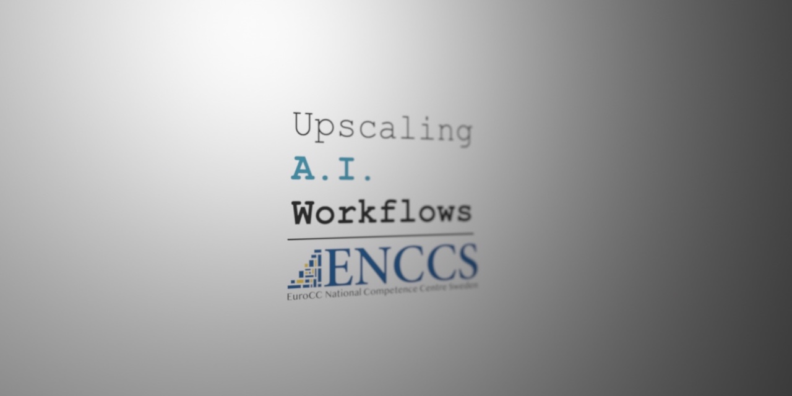
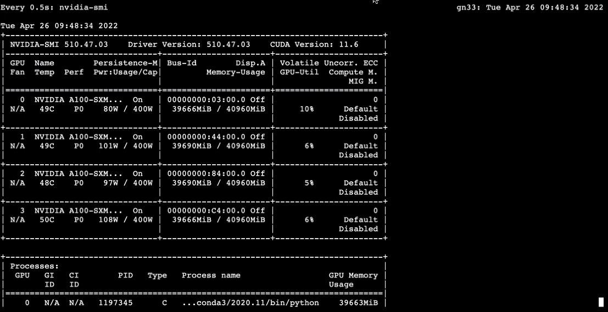

# Upscaling AI Worflows



## Table of Contents
1. [Description](#description)
2. [Instructions](#instructions)
3. [Getting access to HPC resources](#installation)
4. [Certificate](#certificate)

<a name="descripton"></a>
## Description

In this workshop, sponsored by The Swedish EuroCC Hub for High-Performance Computing, we started by overviewing the basics of Docker and Singularity. Then, we used resources from the Slovenian supercomputer, Vega, to do distributed training using TensorFlow and Horovod frameworks. 
Moreover, we also used Docker and Singularity containers in conjunction with TensorFlow and Horovod to upscale an AI app.

Artificial Intelligence (AI) has become a foundational building block of our modern world. Accordingly, a vast effort has been put into bringing AI to researchers and practitioners of a wide range of fields. Nonetheless, the computationally intensive task of training an AI increasingly requires more computational power than what our laptops and PCs can offer. Therefore, the ability to develop and train a neural network on large clusters seems imperative. This workshop teaches us how to scale an AI-powered applications in large clusters, i.e., supercomputers.

The outcomes of the workshop are:
> - Create, deploy, and update containers locally on a supercomputer
> - Upscale the transfer learning of an NLP model in TensorFlow
> - Upscale the transfer learning of an NLP model using Horovod
> - Upscale the transfer learning of a containerized NLP model

<a name="instructions"></a>
## Dependencies

All necessary information and links for the workshop, QA, exercises, tutorials, etc, can be found the the [workshop website](https://hackmd.io/@enccs/upscaling-april2022)

<a name="installation"></a>
## Getting access to HPC resources

Detailed instructions on how to access Vega's resources can be found on [The Swedish EuroCC Hub for High-Performance Computing website](https://enccs.se/).



How to reserve nodes and launch a jupyter notebook on VEGA:

Running Jupyter on Vega and connect to it

To book a node:
```
salloc -n 1 --gres=gpu:1 --reservation=enccs-day1 --mem-per-gpu=40GB --ntasks 4 --cpus-per-task 1 -t 01:00:00
```
You will see something like salloc: Nodes gn38 are ready for job

Login to compute node from login node (replace gn38 with your compute node ID):
```
ssh gn38
```
Load modules on compute node:
```
module load Anaconda3/2020.11
module load scikit-learn
module load TensorFlow/2.5.0-fosscuda-2020b
```
Pick a random port between 8000 and 9000, and replace gnXX
```
jupyter-notebook --no-browser --port=8123 --ip=gnXX
```
From local machine (replace gnXX with name of compute node, and replace 8123 with the port you selected when running jupyter-notebook):
```
ssh -L localhost:9999:gnXX:8123 username@vglogin0005.vega.izum.si
```
Open in your browser (port 9999 should match what you selected in the ssh-tunnel command above):
```
http://localhost:9999/
```

Detailed instrocutions can be found on the [Vega website](https://doc.vega.izum.si/jupyter/).

<a name="certificate"></a>
## Certificate
The certificate can be found here:

[Certificate](https://github.com/HROlive/Upscaling-AI-Worflows/blob/main/images/certificate-hugo-oliveira.pdf)
